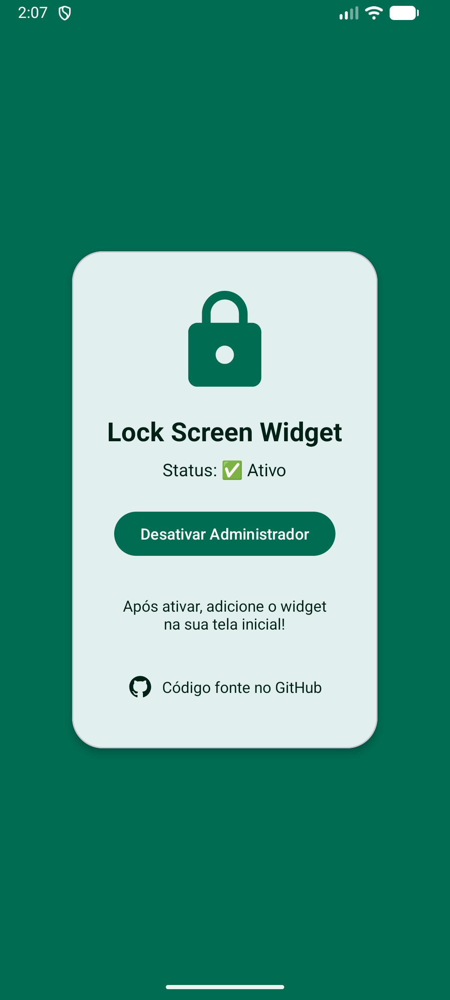

# 🔒 Lock Screen Widget

<p align="center">
  
</p>

<p align="center">
  <a href="#-features">Features</a> •
  <a href="#-download">Download</a> •
  <a href="#-installation">Installation</a> •
  <a href="#-how-to-use">How to Use</a> •
  <a href="#-technologies">Technologies</a> •
  <a href="#-contributing">Contributing</a> •
  <a href="#-license">License</a>
</p>

<p align="center">
  <a href="README.pt-BR.md">🇧🇷 Português</a>
</p>

---

## 📖 About

**Lock Screen Widget** is a simple and elegant Android app that allows you to lock your device screen with just one tap on a home screen widget.

Built with **Material You** design, the app automatically adapts its colors to match your wallpaper on Android 12 and above.

---

## ✨ Features

- 🔒 **One-tap screen lock** - Lock your screen instantly from the home screen
- 🎨 **Material You support** - Dynamic colors based on your wallpaper (Android 12+)
- 🌙 **Dark/Light theme** - Automatically follows system theme
- 📱 **Lightweight** - Minimal battery and storage usage
- 🚀 **Easy setup** - Simple activation process
- 🆓 **Free & Open Source** - No ads, no tracking

---

## 📥 Download

### Latest Release

[](https://github.com/Gabrick75/LockScreenApp/releases/latest)

[⬇️ Download APK](https://github.com/Gabrick75/LockScreenApp/releases/latest)

---

## 📲 Installation

### From APK

1. Download the latest APK from [Releases](https://github.com/Gabrick75/LockScreenApp/releases)
2. Enable "Install from unknown sources" if prompted
3. Install the APK
4. Open the app and follow the setup instructions

### From Source

```bash
# Clone the repository
git clone https://github.com/Gabrick75/LockScreenApp.git

# Open in Android Studio
# Build and run on your device
```
---

## 🚀 How to Use

### Step 1: Activate Device Admin

1. Open the **Lock Screen Widget** app
2. Tap **"Activate Administrator"**
3. Confirm the activation

<p align="center">
  
</p>

### Step 2: Add the Widget

1. Go to your **home screen**
2. **Long press** on an empty area
3. Select **"Widgets"**
4. Find **"Lock Screen Widget"**
5. Drag it to your home screen

### Step 3: Lock Your Screen

Simply **tap the widget** to instantly lock your screen! 🔒

---

## 🛠️ Technologies

| Technology | Purpose |
|------------|---------|
| **Kotlin** | Programming language |
| **Android SDK** | Native Android development |
| **Material Design 3** | Modern UI components |
| **Material You** | Dynamic theming (Android 12+) |
| **Device Admin API** | Screen lock functionality |

---

## 📋 Requirements

| Requirement | Minimum |
|-------------|---------|
| **Android Version** | 7.0 (API 24) |
| **Material You** | Android 12+ (API 31) |

---

## 📁 Project Structure

    app/
    ├── src/main/
    │   ├── java/com/lockscreen/app/
    │   │   ├── MainActivity.kt
    │   │   ├── LockScreenWidget.kt
    │   │   └── MyDeviceAdminReceiver.kt
    │   ├── res/
    │   │   ├── layout/
    │   │   ├── drawable/
    │   │   ├── values/
    │   │   └── xml/
    │   └── AndroidManifest.xml
    └── build.gradle.kts

---

## 🤝 Contributing

Contributions are welcome! Here's how you can help:

1. **Fork** the repository
2. **Create** a feature branch (`git checkout -b feature/AmazingFeature`)
3. **Commit** your changes (`git commit -m 'Add some AmazingFeature'`)
4. **Push** to the branch (`git push origin feature/AmazingFeature`)
5. **Open** a Pull Request

### Ideas for Contribution

- [ ] Add widget customization options
- [ ] Add multiple widget sizes
- [ ] Translate to more languages

---

## 🐛 Known Issues

| Issue | Reason | Workaround |
|-------|--------|------------|
| "Device locked by work policy" message | Device Admin API limitation | None (Android limitation) |
| Fingerprint disabled after lock | Device Admin API limitation | Use PIN/Password |

> **Note:** These limitations are due to Android's Device Admin API. A future update may include an Accessibility Service option that allows biometric unlock.

---

## 📄 License

This project is licensed under the **MIT License** - see the [LICENSE](LICENSE) file for details.

---

## 👤 Author

**Your Name**

- GitHub: [@Gabrick75](https://github.com/Gabrick75)

---

## ⭐ Show Your Support

Give a ⭐ if this project helped you!

---

<p align="center">
  Made with ❤️ for Android
</p>